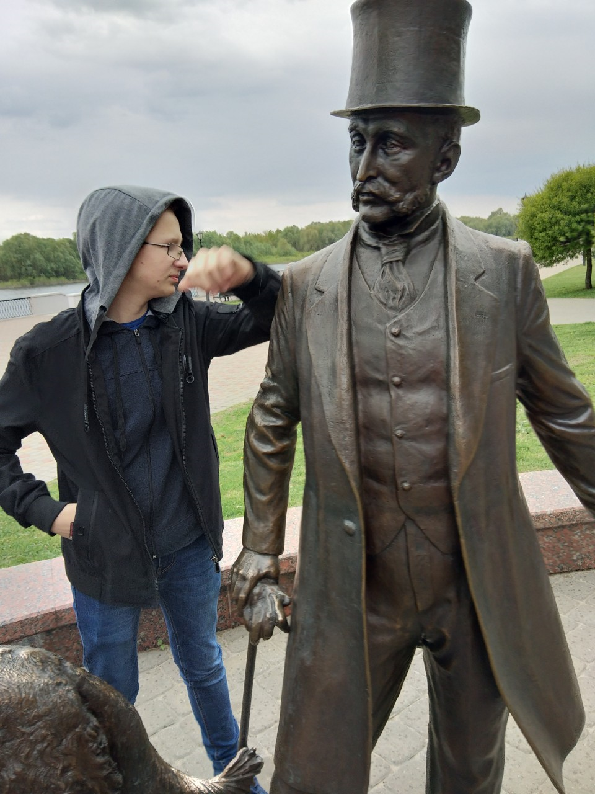

# rsschool-cv
---
# Ilya Nagibov

---
## My Contacts:
* location: Minsk, Belarus
* emails: nilr801@gmail.com, fpm.nagibov@bsu.by
* phone: +375299082454
* GitHub: [Ilya Nagibov](https://github.com/nilr801/rsschool-cv)
---

## About Me:

_I have good interpersonal skills, am an excellent team worker and very willing to learn and develop new skills._

---
## Skills:
* C++
* Qt
* GitHub
---
## Code Example:
~~~
int a=5;
int b=3;
int sum=a+b;
std::cout<<sum; 
~~~
---
## Education:
__BSU, FPMI, computer security, 2 course__

---
## My knowledge:
предмет | оценка
:---|:----:|
мат.анализ| 8
ДМиМЛ| 8
алгебра| 8
программирование| 8
